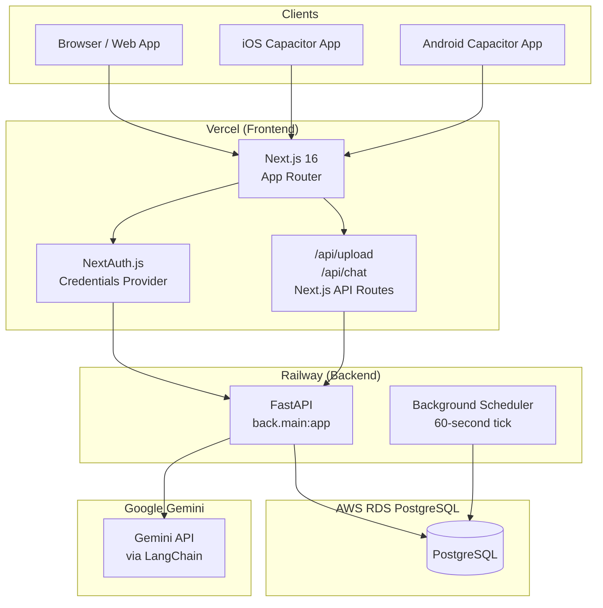
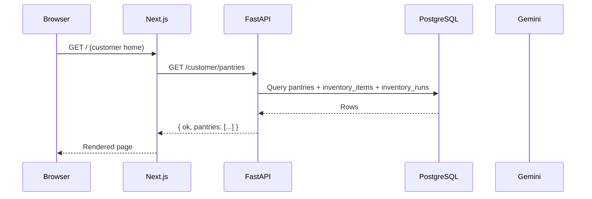
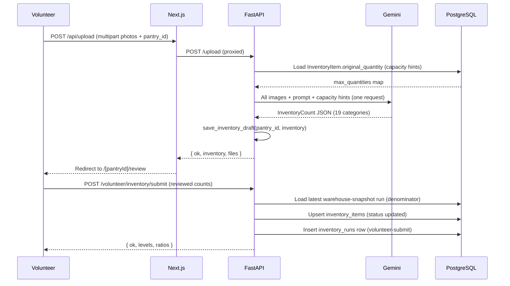
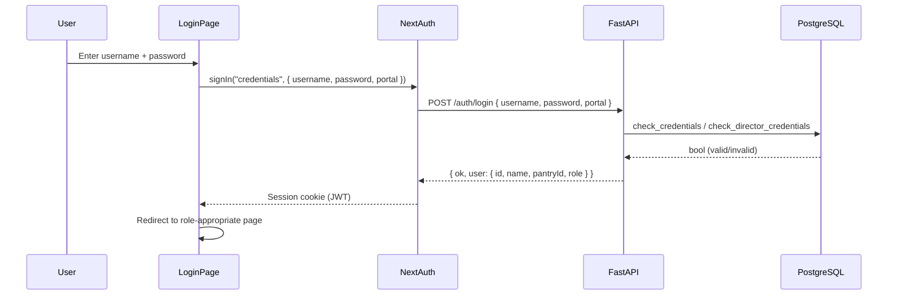
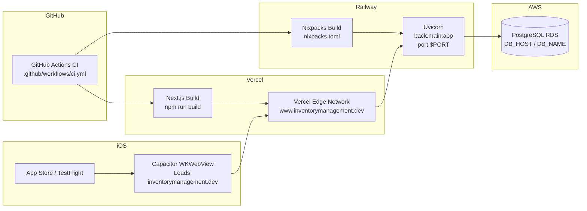
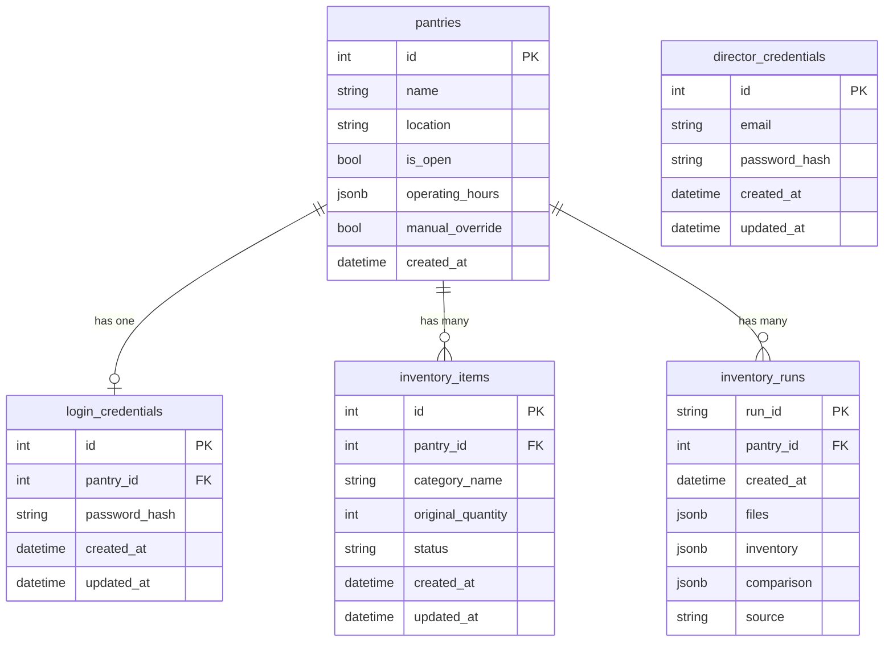

# GenAI Inventory — System Documentation

> **Developer handoff guide.** This document describes every layer of the system: architecture, database schema, API contracts, frontend structure, test suites, and deployment topology.

---

## Table of Contents

1. [Project Overview](#1-project-overview)
2. [Technology Stack](#2-technology-stack)
3. [System Architecture](#3-system-architecture)
4. [Database Schema](#4-database-schema)
5. [Backend API Reference](#5-backend-api-reference)
6. [Frontend Structure](#6-frontend-structure)
7. [Authentication & Authorization](#7-authentication--authorization)
8. [AI Integration (Google Gemini)](#8-ai-integration-google-gemini)
9. [Mobile (iOS / Android via Capacitor)](#9-mobile-ios--android-via-capacitor)
10. [Environment Variables](#10-environment-variables)
11. [Local Development Setup](#11-local-development-setup)
12. [Deployment](#12-deployment)
13. [File Index](#13-file-index)
14. [Functional Requirements](#14-functional-requirements)
15. [Non-Functional Requirements](#15-non-functional-requirements)
16. [Test Suites](#16-test-suites)

---

## 1. Project Overview

### What it does

GenAI Inventory is a food inventory management system for the **Food Pantry Network (FPN)**, a regional non-profit that coordinates community food pantries in the Newark, Ohio area. It solves the operational problem of tracking what food is on pantry shelves without requiring staff to manually enter counts spreadsheet-by-spreadsheet.

### The core workflow

1. A **volunteer** photographs pantry shelves with their phone.
2. **Google Gemini** (multimodal AI) counts every visible food item in the photos and maps it to one of 19 fixed categories.
3. The volunteer reviews and edits the AI-detected quantities, then submits.
4. **Customers** visit the public home page and see real-time inventory levels (High / Mid / Low / Out) for every pantry.
5. A **manager** uploads a warehouse order-form photo. Gemini OCR extracts the "Amount Shipped" column and sets a new baseline (maximum capacity) for each category.
6. A **director** (system administrator) manages pantry accounts, operating hours, and open/closed status from a dashboard.

### User roles

| Role | Who they are | Primary access |
|------|--------------|----------------|
| **Customer** | General public | Public home page, chatbot |
| **Volunteer** | Pantry staff | Photo upload, review, submit |
| **Manager** | Pantry coordinator | Order-form upload, baseline update |
| **Director** | FPN administrator | Pantry CRUD, scheduling, credentials |

### Deployment status

- **Frontend**: Deployed on Vercel at `https://www.inventorymanagement.dev`
- **Backend**: Deployed on Railway (Python / Uvicorn)
- **Database**: PostgreSQL on AWS RDS (or Railway-managed)
- **Mobile**: Capacitor hybrid app — iOS and Android shells wrapping the production web URL. The iOS project is under `front/ios/`, the Android project under `front/android/`.

### Plain-English summary

The system is a **Capacitor hybrid web app**: a Next.js 16 React frontend that runs in the browser and, when deployed to mobile, inside a thin iOS/Android native wrapper (`CAPBridgeViewController`). All real UI is web code — there is no native SwiftUI or Kotlin UI. The FastAPI Python backend exposes a REST API consumed by the frontend; it persists data in PostgreSQL and calls Google Gemini for AI analysis. NextAuth.js manages sessions. The system runs two concurrent deployment targets: the Vercel web app (consumed directly by browsers and embedded in the Capacitor WKWebView) and the Railway FastAPI backend.

---

## 2. Technology Stack

### Core dependencies

| Technology | Version | Where used | Purpose | Key files |
|------------|---------|------------|---------|-----------|
| **Next.js** | 16.1.6 | Frontend | React framework, App Router, API proxy routes | `front/app/`, `front/next.config.*` |
| **React** | 19.2.3 | Frontend | UI rendering | `front/app/`, `front/components/` |
| **Tailwind CSS** | 4.x | Frontend | Utility-first styling | `front/app/globals.css`, `front/styles/tokens.css` |
| **TypeScript** | 5.x | Frontend | Type safety | `front/tsconfig.json`, all `.tsx`/`.ts` files |
| **NextAuth.js** | 4.24.13 | Frontend | Session management, credentials auth provider | `front/app/providers.tsx`, `front/app/login/page.tsx` |
| **react-markdown** | 10.1.0 | Frontend | Render chatbot Markdown replies | `front/components/chat/FloatingChat.tsx` |
| **remark-gfm** | 4.0.1 | Frontend | GitHub Flavored Markdown tables/strikethrough | `front/components/chat/FloatingChat.tsx` |
| **Capacitor** | 8.3.1 | Mobile | iOS/Android hybrid wrapper | `front/capacitor.config.ts`, `front/ios/`, `front/android/` |
| **@capacitor/camera** | 8.1.0 | Mobile | Native camera and photo library access | `front/lib/camera.ts` |
| **FastAPI** | 0.115.6 | Backend | REST API framework | `back/main.py`, `back/routers/` |
| **Uvicorn** | 0.32.1 | Backend | ASGI server | `railway.toml`, `nixpacks.toml` |
| **SQLAlchemy** | 2.0+ | Backend | ORM and database access | `db/models.py`, `db/database.py` |
| **PostgreSQL** | 16 | Database | Primary persistent store | AWS RDS / Railway |
| **psycopg2-binary** | 2.9+ | Backend | PostgreSQL driver | `back/requirements.txt` |
| **Pydantic** | (bundled with FastAPI) | Backend | Request/response validation | `back/schemas.py` |
| **python-dotenv** | 1.0+ | Backend | `.env` file loading | `back/config.py`, `db/database.py` |
| **bcrypt** | 3.2+ / 5.0 | Backend | Password hashing | `db/password_utils.py` |
| **langchain-google-genai** | 2.0+ | Backend | Google Gemini API client | `back/services/gemini.py`, `back/services/gemini_chatbot.py` |
| **langchain-core** | 0.3+ | Backend | LangChain message types | `back/services/gemini.py` |
| **tzdata** | latest | Backend | Timezone data (IANA, for scheduler) | `back/scheduler.py` |
| **aiosqlite** | 0.22.1 | Backend (tests) | Async SQLite for test isolation | `back/requirements-dev.txt` |

### Frontend tooling

| Tool | Purpose | Config file |
|------|---------|------------|
| **ESLint 9** | TypeScript linting | `front/eslint.config.mjs` |
| **PostCSS** | Tailwind CSS build pipeline | `front/postcss.config.mjs` |
| **Jest 29** | Unit/component/integration tests | `front/jest.config.js` |
| **jest-environment-jsdom** | DOM simulation for component tests | `front/jest.config.js` |
| **@testing-library/react** | Component rendering in tests | `front/__tests__/component/` |
| **@testing-library/user-event** | User interaction simulation | `front/__tests__/component/` |
| **MSW 2** | Mock Service Worker (installed, not active in Jest) | `front/__tests__/mocks/` |
| **Playwright 1.59** | End-to-end browser tests | `front/playwright.config.ts` |

### Backend tooling

| Tool | Purpose | Config file |
|------|---------|------------|
| **pytest** | Test runner | `pytest.ini` |
| **pytest-asyncio** | Async test support | `back/requirements-dev.txt` |
| **httpx TestClient** | FastAPI integration testing | `back/tests/conftest.py` |
| **coverage.py** | Code coverage collection | `pytest.ini`, `.coverage` |

### Deployment & infrastructure

| Service | Role | Config |
|---------|------|--------|
| **Vercel** | Frontend hosting, CDN, HTTPS | Vercel project settings |
| **Railway** | Backend hosting | `railway.toml`, `nixpacks.toml` |
| **AWS RDS** | PostgreSQL database | `back/.env` (`DB_HOST`, `DB_NAME`, etc.) |
| **Google Gemini** | AI inventory detection and chatbot | `back/config.py` (`GEMINI_MODEL`) |
| **GitHub Actions** | CI pipeline | `.github/workflows/ci.yml` |

---

## 3. System Architecture

### High-level architecture



### Request/response flow

Every browser request goes to Vercel (Next.js). Pages that need backend data call the FastAPI backend directly from client components using `NEXT_PUBLIC_API_URL`, or go through Next.js API proxy routes (`/api/upload`, `/api/chat`) for server-side forwarding.



### Upload/inventory detection flow



### Authentication flow



### Role-based access

| Route | Customer | Volunteer (pantry role) | Manager (pantry role) | Director |
|-------|----------|------------------------|----------------------|----------|
| `/` | ✅ Public | ✅ | ✅ | ✅ |
| `/login` | ✅ Public | ✅ | ✅ | ✅ |
| `/{pantryId}/upload` | ❌ | ✅ (own pantry) | ❌ | ✅ (selects pantry) |
| `/{pantryId}/review` | ❌ | ✅ | ❌ | ✅ |
| `/{pantryId}/dashboard` | ❌ | ✅ | ❌ | ✅ |
| `/manager` | ❌ | ❌ | ✅ | ✅ |
| `/manager/review` | ❌ | ❌ | ✅ | ✅ |
| `/director/dashboard` | ❌ | ❌ | ❌ | ✅ |

Access is enforced client-side via `useSession()` checks and server-side via NextAuth session middleware. The backend does not currently enforce per-role authorization on API endpoints (relies on session isolation).

### Deployment architecture



---

## 4. Database Schema

Database: **PostgreSQL** accessed via **SQLAlchemy 2.x** ORM.

Connection configured in `db/database.py` from env vars: `DB_HOST`, `DB_PORT`, `DB_NAME`, `DB_USER`, `DB_PASSWORD`.

### Table: `pantries`

Represents one physical food pantry location.

| Column | Type | Constraints | Description |
|--------|------|-------------|-------------|
| `id` | INTEGER | PK, auto-increment | Stable identifier used in all cross-table references and URL paths |
| `name` | VARCHAR(100) | NOT NULL | Human-readable pantry name |
| `location` | VARCHAR(255) | nullable | Address or location text shown to customers |
| `is_open` | BOOLEAN | NOT NULL, default TRUE | Whether the pantry is currently open for visitors |
| `operating_hours` | JSONB | nullable | Weekly hours array: `[{"day":"mon","open":"11:00","close":"16:00"},...]` |
| `manual_override` | BOOLEAN | NOT NULL, default FALSE | When TRUE the scheduler skips this pantry and preserves the manual `is_open` value |
| `created_at` | DATETIME | default utcnow | Row creation timestamp |

**Indexes:** `ix_pantries_name` on `name`.

**Relationships:** One pantry has many `inventory_items` (cascade delete).

---

### Table: `login_credentials`

Stores bcrypt-hashed passwords for pantry (volunteer/manager) accounts.

| Column | Type | Constraints | Description |
|--------|------|-------------|-------------|
| `id` | INTEGER | PK | Auto-increment |
| `pantry_id` | INTEGER | FK → `pantries.id` (CASCADE), UNIQUE | One credential row per pantry |
| `password_hash` | VARCHAR(255) | NOT NULL | bcrypt hash (cost 12) |
| `created_at` | DATETIME | | |
| `updated_at` | DATETIME | onupdate | |

---

### Table: `director_credentials`

Stores the single director (system administrator) account.

| Column | Type | Constraints | Description |
|--------|------|-------------|-------------|
| `id` | INTEGER | PK | Auto-increment |
| `email` | VARCHAR(100) | UNIQUE, NOT NULL | Director login email (default: `director@example.com`) |
| `password_hash` | VARCHAR(255) | NOT NULL | bcrypt hash |
| `created_at` | DATETIME | | |
| `updated_at` | DATETIME | onupdate | |

---

### Table: `inventory_items`

Stores per-pantry, per-category baseline quantity and current status. There is one row per (pantry, category) pair.

| Column | Type | Constraints | Description |
|--------|------|-------------|-------------|
| `id` | INTEGER | PK | Auto-increment |
| `pantry_id` | INTEGER | FK → `pantries.id` (CASCADE) | Owning pantry |
| `category_name` | VARCHAR(255) | NOT NULL | One of the 19 fixed inventory categories |
| `original_quantity` | INTEGER | NOT NULL, ≥ 0 | Baseline/maximum capacity from the latest manager upload |
| `status` | VARCHAR(50) | default "normal" | High / Mid / Low / Out — computed from latest volunteer submission |
| `created_at` | DATETIME | | |
| `updated_at` | DATETIME | onupdate | |

**Indexes:** `ix_inventory_items_pantry_category` on `(pantry_id, category_name)`, `ix_inventory_items_status` on `status`.

**Status thresholds** (computed in `InventoryItem.update_status()`):

| Condition | Status |
|-----------|--------|
| `current_qty == 0` | **Out** |
| `current_qty < 30% of original_qty` | **Low** |
| `current_qty < 70% of original_qty` | **Mid** |
| `current_qty >= 70% of original_qty` | **High** |

---

### Table: `inventory_runs`

Unified run-history table storing both warehouse imports and volunteer submissions.

| Column | Type | Constraints | Description |
|--------|------|-------------|-------------|
| `run_id` | VARCHAR(36) | PK | UUID v4 string |
| `pantry_id` | INTEGER | FK → `pantries.id` (CASCADE) | Owning pantry |
| `created_at` | DATETIME | NOT NULL, default utcnow | Timestamp for ordering — determines which run is "latest" |
| `files` | JSONB | nullable | Array of `{filename, size_bytes, content_type, ok}` metadata |
| `inventory` | JSONB | NOT NULL | `{"Beverages": 12, "Juices": 5, ...}` — actual count per category |
| `comparison` | JSONB | nullable | Derived context: `warehouseRunId`, `ratios`, `levels`, `summaryCounts`, `note` |
| `source` | VARCHAR(50) | nullable | `"warehouse-snapshot"` or `"volunteer-submit"` |

**Index:** `ix_inventory_runs_pantry_created_at` on `(pantry_id, created_at)`.

**Source semantics:**

- `warehouse-snapshot`: Set by a manager order-form upload. The `inventory` column holds the baseline (maximum expected) quantities. Used as the denominator when computing ratios for volunteer submits.
- `volunteer-submit`: Set by a volunteer submission. The `inventory` column holds the current pantry stock. The `comparison.warehouseInventory` field records the exact baseline used.

---

### Entity Relationship Diagram



---

## 5. Backend API Reference

Base URL (local): `http://localhost:8000`
Base URL (production): Railway deployment URL

All endpoints return JSON. Error responses follow `{ "ok": false, "error": "..." }`.

---

### General

#### `GET /`
Health check. Returns `{ "status": "ok" }`.

#### `GET /categories`
Returns the fixed 19-category list used by all upload and review screens.

```json
{ "categories": ["Beverages", "Juices", ..., "Misc Products"] }
```

---

### Upload (`/upload`)

#### `POST /upload`
Upload one or more shelf photos for AI inventory detection.

**Request:** `multipart/form-data`
- `files`: One or more image files (PNG, JPG, WEBP)
- `pantry_id`: (optional) Pantry ID string — used to load capacity hints from `inventory_items`

**Response (success):**
```json
{
  "ok": true,
  "count": 2,
  "files": [{ "filename": "shelf.jpg", "size_bytes": 102400, "ok": true }],
  "inventory": { "Beverages": 12, "Juices": 5, ... }
}
```

**Behavior:**
1. Validates all files are images (`content_type` starts with `image/`).
2. Loads `InventoryItem.original_quantity` from the DB as capacity hints for Gemini.
3. Sends all images in a single Gemini API call.
4. If `pantry_id` is provided, saves the result to the in-memory draft store (`LATEST_DRAFTS`).

---

### Auth (`/auth`)

#### `POST /auth/login`
Authenticate director or pantry users.

**Request:**
```json
{ "username": "1", "password": "secret", "portal": "volunteer" }
```
- `username`: Numeric pantry ID, pantry name, `"director"`, or `"director@example.com"`
- `portal`: `"volunteer"`, `"manager"`, or `"director"` (optional — prevents cross-portal logins)

**Response:**
```json
{
  "ok": true,
  "user": { "id": "1", "name": "FPN Pantry", "pantryId": "1", "role": "pantry", "email": null }
}
```

#### `GET /auth/pantry-credentials`
Returns all pantries with whether credentials are configured (director dashboard).

#### `POST /auth/pantry/create`
Create a new pantry and set its initial login password.

#### `POST /auth/pantry/manage`
Update pantry name, location, and/or password.

#### `POST /auth/pantry/credentials/delete`
Remove stored login credentials for a pantry (pantry can no longer log in).

#### `POST /auth/pantry/password`
Set or rotate the password for a pantry.

#### `POST /auth/pantry/schedule`
Save weekly operating hours for a pantry. Triggers immediate open/closed re-evaluation unless `manual_override` is active.

**Schedule format:**
```json
{
  "pantryId": "1",
  "operatingHours": [
    { "day": "mon", "open": "09:00", "close": "17:00" },
    { "day": "wed", "open": "11:00", "close": "15:00" }
  ]
}
```

#### `POST /auth/pantry/toggle-status`
Flip `is_open` and set `manual_override = true`. The scheduler will not overwrite a manual override.

#### `POST /auth/pantry/set-status`
Explicitly set `is_open` and activate `manual_override`.

#### `POST /auth/pantry/clear-override`
Clear `manual_override` and immediately re-evaluate the schedule from `operating_hours`.

#### `POST /auth/director/password`
Update the director account password (must supply the registered director email).

---

### Customer (`/customer`)

#### `GET /customer/pantries`
Returns all pantries with current inventory levels for the customer home page.

**Response:**
```json
{
  "ok": true,
  "pantries": [{
    "pantryId": "1",
    "name": "FPN Market at LMHS",
    "location": "123 Main St, Newark, OH",
    "lastUpdated": "2025-12-01T14:30:00",
    "levels": { "Beverages": "High", "Meat": "Low", ... },
    "originalQuantities": { "Beverages": 50, "Meat": 20, ... },
    "isOpen": true,
    "manualOverride": false,
    "operatingHours": [{ "day": "mon", "open": "09:00", "close": "17:00" }]
  }]
}
```

**Inventory level precedence rule** (see `customer_inventory_state.py`):
1. Use latest `volunteer-submit` run if it is same time or newer than the latest `warehouse-snapshot`.
2. Otherwise use latest `warehouse-snapshot`.
3. If neither exists, use fallback data from `inventory_items`.

#### `GET /customer/pantries-by-time?day=mon&time=14:30`
Filter pantries that are open at a given day and time. Returns the same shape as `/customer/pantries` but only for pantries with matching `operating_hours`.

---

### Manager (`/manager`)

#### `POST /manager/order-form`
Upload one or more warehouse order-form page images. Gemini extracts the "Amount Shipped" column using OCR.

**Response:**
```json
{
  "ok": true,
  "count": 2,
  "inventory": { "Beverages": 24, "Meat": 36, ... },
  "pageInventories": [{ "Beverages": 12, ... }, { "Beverages": 12, ... }]
}
```

#### `POST /manager/inventory/{pantry_id}`
Update the baseline (`original_quantity`) for all 19 categories of a pantry. Combines the incoming manager quantities with the latest volunteer-submitted current stock, then saves a `warehouse-snapshot` run.

**Request body:**
```json
{ "inventory": { "Beverages": 48, "Meat": 36, ... } }
```

---

### Volunteer Inventory

#### `POST /volunteer/inventory/submit`
Submit a reviewed pantry snapshot. Requires a `warehouse-snapshot` run to exist (provides the denominator for ratio computation).

**Request:**
```json
{ "pantryId": "1", "inventory": { "Beverages": 12, "Meat": 5, ... } }
```

**Behavior:**
1. Loads the latest `warehouse-snapshot` run for the pantry.
2. Updates `inventory_items` status fields.
3. Computes ratios and levels.
4. Inserts a `volunteer-submit` `inventory_runs` row.

**Response:**
```json
{
  "ok": true,
  "runId": "uuid",
  "warehouseRunId": "uuid",
  "warehouseInventory": { ... },
  "ratios": { "Beverages": 0.75, ... },
  "levels": { "Beverages": "High", ... }
}
```

#### `POST /warehouse/inventory/snapshot`
Store a warehouse snapshot directly (without manager order-form OCR). Used by the manager review submit flow.

---

### Review

#### `GET /inventory/draft/{pantry_id}`
Return the latest in-memory upload draft for a pantry (set by `POST /upload`). This is ephemeral — cleared on server restart.

---

### Chat (`/chat`)

#### `POST /chat/message`
Send a user message to the Gemini chatbot with optional DB context and location.

**Request:**
```json
{
  "message": "What pantries are open today?",
  "history": [["user", "Hi"], ["assistant", "Hello!"]],
  "pantry_id": 1,
  "user_location": { "latitude": 40.06, "longitude": -82.43, "accuracy": 15.0 }
}
```

**Behavior:**
1. Short-circuits deterministic answers: pantry count, nearest-pantry questions.
2. For nearest-pantry queries, uses browser GPS, ZIP code, or city name matching.
3. Fetches a DB snapshot of pantry names, inventory levels, and hours, injects it as a system context message, then asks Gemini.

**Response:**
```json
{ "ok": true, "reply": "There are 3 pantries open on Monday..." }
```

---

### Background Scheduler

Runs inside the FastAPI process lifecycle (started/stopped in `main.py`'s `lifespan`). Every 60 seconds it queries all pantries that have `operating_hours` and `manual_override = false`, computes whether each should currently be open or closed based on `America/New_York` time, and updates `is_open` if it has changed.

---

## 6. Frontend Structure

### Next.js App Router pages

```
front/app/
├── layout.tsx                  Root layout; SessionProvider + ToastProvider; viewport meta
├── globals.css                 Global styles (Tailwind directives, scroll polish, safe-area)
├── providers.tsx               Client wrapper: NextAuth SessionProvider + ToastProvider
├── favicon.ico
├── page.tsx                    Customer home page (public) — pantry list, search, chat, time filter
│
├── login/
│   ├── layout.tsx              Minimal login layout (no AppShell)
│   └── page.tsx                Login form — portal detection (volunteer/manager/director)
│
├── [pantryId]/
│   ├── upload/
│   │   ├── layout.tsx          Upload route layout
│   │   └── page.tsx            Volunteer photo upload (AppShell, UploadDropzone, preview)
│   ├── review/
│   │   └── page.tsx            Volunteer review (CategoryGroupEditor, submit to API)
│   └── dashboard/
│       ├── page.tsx            Dashboard entry (server component, loads data)
│       └── dashboard-client.tsx Dashboard client UI (inventory table, stats, chart)
│
├── manager/
│   ├── page.tsx                Manager order-form upload page
│   └── review/
│       └── page.tsx            Manager review (CategoryGroupEditor, baseline submit)
│
└── api/
    ├── chat/route.ts           Server-side chat proxy → POST /chat/message on FastAPI
    └── upload/route.ts         Server-side upload proxy → POST /upload on FastAPI (110s timeout)
```

### Components

```
front/components/
├── chat/
│   └── FloatingChat.tsx        Expandable chat widget; typing animation; location capture
├── inventory/
│   ├── InventoryTable.tsx      Tabular inventory display with level badges
│   ├── LevelBadge.tsx          High/Mid/Low/Out colored badge chip
│   ├── RatioBar.tsx            Visual ratio bar for category fill level
│   └── SummaryCards.tsx        Stats summary cards (High/Mid/Low/Out counts)
├── layout/
│   └── AppShell.tsx            Shared sticky header + nav for authenticated pages
├── ui/
│   ├── Alert.tsx               Inline alert (info/success/warning/error tones)
│   ├── Badge.tsx               Small status badge
│   ├── Button.tsx              Design system button (variants: primary/secondary/ghost/danger)
│   ├── Card.tsx                Rounded card container
│   ├── ConfirmModal.tsx        Accessible modal dialog with focus trap
│   ├── EmptyState.tsx          Empty state placeholder
│   ├── Input.tsx               Styled text input (min-h 44px, placeholder color fixed)
│   ├── SectionHeader.tsx       Section title + subtitle
│   ├── Select.tsx              Styled select dropdown
│   ├── Skeleton.tsx            Loading skeleton shimmer
│   └── Toast.tsx               Toast notification system (context provider + hook)
└── workflow/
    ├── CategoryGroupEditor.tsx  +/− stepper + number input for 19 inventory categories (5 groups)
    ├── FileList.tsx             Uploaded file list display
    ├── FlowStepper.tsx          Upload → Review → Submit step indicator
    ├── StickyActionBar.tsx      Sticky bottom action bar
    └── UploadDropzone.tsx       Drag-and-drop or tap-to-select; native camera/gallery on mobile
```

### Shared frontend libraries

```
front/lib/
├── api.ts                      getApiBase() — returns NEXT_PUBLIC_API_URL or localhost:8000
├── camera.ts                   Capacitor Camera plugin helpers (takePhoto, pickPhotos)
└── inventoryCategories.ts      INVENTORY_CATEGORIES array + CATEGORY_GROUPS (5 groups of 4)
```

### Styles

- `front/app/globals.css` — Tailwind base, `scroll-behavior: smooth`, `-webkit-overflow-scrolling: touch`, dark mode transitions
- `front/styles/tokens.css` — CSS custom properties: `--brand-*`, `--success-*`, `--warning-*`, `--danger-*` with dark mode overrides

---

## 7. Authentication & Authorization

### How login works

1. User submits username + password to the Next.js login page.
2. The page calls `signIn("credentials", { username, password, portal })` from NextAuth.
3. NextAuth's credentials provider forwards the credentials to `POST /auth/login` on the FastAPI backend.
4. FastAPI validates:
   - If username is `"director"` or `"director@example.com"` → check `director_credentials` table
   - If username is numeric → check `login_credentials` for that pantry ID
   - If username is a string → look up pantry by name, then check credentials
5. FastAPI returns `{ ok, user: { id, name, pantryId, role } }`.
6. NextAuth creates a signed JWT session cookie (`NEXTAUTH_SECRET`).

### Session shape (JWT payload)

```typescript
{
  user: {
    id: string,         // pantry ID or "director"
    name: string,       // username or "Director"
    email: string | null,
    pantryId: string,   // pantry ID or "director"
    role: "pantry" | "director"
  }
}
```

### Password hashing

`db/password_utils.py` uses **bcrypt** (cost 12). Passwords longer than 72 bytes are pre-hashed with SHA-256 and prefixed with `sha256$` before bcrypt hashing, to avoid bcrypt's 72-byte truncation.

### Portal enforcement

The login page reads the `callbackUrl` query parameter to detect which portal is being accessed:
- `/volunteer` → volunteer portal (requires `role === "pantry"`)
- `/manager` → manager portal (requires `role === "pantry"`)
- `/director/dashboard` → director portal (requires `role === "director"`)

If a signed-in user's role does not match the requested portal, they are signed out with an error message.

---

## 8. AI Integration (Google Gemini)

### Model

The active Gemini model is configured in `back/config.py` as `GEMINI_MODEL`.

### Inventory detection from shelf photos (`back/services/gemini.py`)

The function `call_gemini_inventory_images(images, max_quantities)` sends all uploaded photos in a **single Gemini API call** using LangChain's `ChatGoogleGenerativeAI` with `with_structured_output(InventoryCount)`.

**Prompt behavior:**
- All 19 categories must be present in the response.
- Items are counted across all photos in one pass; overlapping shelves should not be double-counted.
- When `max_quantities` is provided (loaded from `InventoryItem.original_quantity`), Gemini is instructed not to exceed the known capacity for each category.
- Output is validated and coerced to `InventoryCount` (Pydantic model with integer fields).

### Order-form OCR (`back/services/gemini.py`)

`call_gemini_order_form(image_bytes, mime_type)` sends one order-form page image with a specialized OCR prompt:
- Targets the **"Amount Shipped" column** (not "Amount Ordered").
- Maps product descriptions to the 19 fixed categories.
- Does **not** multiply by case size.

### Chatbot (`back/services/gemini_chatbot.py`)

`call_gemini_chat(...)` is a retrieval-augmented chatbot:
1. Deterministic short-circuit for pantry count questions.
2. For "nearest pantry" questions: uses browser GPS, ZIP, or city name matching against hardcoded coordinates for known pantry locations.
3. For general questions: fetches a compact DB snapshot (all pantry inventory states) and injects it as a system message, then passes the conversation history to Gemini.

**System prompt:** instructs Gemini to use the DB snapshot as the source of truth, defer to the volunteer-submit precedence rule, and not ask the user to choose between data sources.

### Error handling

Both Gemini services handle:
- Rate limit errors (HTTP 429 / `resource_exhausted`) → return `None` silently
- General API errors → log and return `None`
- Missing API key → log warning, return `None`

---

## 9. Mobile (iOS / Android via Capacitor)

The web frontend is packaged as a native app using **Capacitor 8.3.1**.

### How it works

- `front/capacitor.config.ts` configures the Capacitor wrapper.
- `npx cap sync` copies the web build output and native plugin code into `front/ios/` and `front/android/`.
- The iOS app is a thin `CAPBridgeViewController` shell that loads the web frontend URL from a `WKWebView`.
- There is **no SwiftUI or UIKit UI code** — all UI is web/React.

### Capacitor config (`front/capacitor.config.ts`)

```typescript
{
  appId: "com.geninventory.app",
  appName: "GenAI Inventory",
  webDir: "out",                    // Next.js static export directory
  server: {
    url: "https://www.inventorymanagement.dev",  // Loads production web app
    cleartext: false,
    androidScheme: "https",
  },
  ios: {},
  plugins: {
    Camera: { presentationStyle: "fullscreen" },
    Keyboard: { resize: "body", style: "default", resizeOnFullScreen: true },
  }
}
```

### Custom iOS ViewController (`front/ios/App/App/ViewController.swift`)

A `ViewController` subclass of `CAPBridgeViewController` sets `contentInsetAdjustmentBehavior = .always` so the WKWebView pushes content below the iOS status bar automatically, regardless of whether the production server has deployed the `viewport-fit=cover` meta tag.

### Native camera integration (`front/lib/camera.ts`)

On native platforms (`Capacitor.isNativePlatform() === true`), the `UploadDropzone` component shows native camera and photo-gallery buttons instead of the web drag-and-drop zone. Photos are captured via `@capacitor/camera` and converted to `File` objects using `fetch(photo.webPath)` followed by `response.blob()`.

**Important:** The `ios.limitsNavigationsToAppBoundDomains` flag must **not** be set in the Capacitor config because Capacitor's camera plugin returns `capacitor://localhost/...` photo URLs, and WKWebView would block the `fetch()` call if localhost is not in `WKAppBoundDomains`.

### iOS permissions (Info.plist)

```xml
<key>NSCameraUsageDescription</key>
<string>Take shelf photos for inventory detection</string>
<key>NSPhotoLibraryUsageDescription</key>
<string>Choose shelf photos for inventory detection</string>
<key>NSPhotoLibraryAddUsageDescription</key>
<string>Save shelf photos for inventory detection</string>
<key>NSLocationWhenInUseUsageDescription</key>
<string>Use your location to suggest the nearest pantry...</string>
```

### Safe area handling

- `viewport-fit=cover` is set in `front/app/layout.tsx` (`export const viewport: Viewport = { viewportFit: "cover" }`).
- Pages use `env(safe-area-inset-top)` and `env(safe-area-inset-bottom)` in inline styles.
- `AppShell` header uses `paddingTop: "env(safe-area-inset-top)"` to avoid the status bar.

---

## 10. Environment Variables

### Backend (`back/.env`)

| Variable | Required | Description |
|----------|----------|-------------|
| `DB_HOST` | Yes | PostgreSQL host (e.g., RDS endpoint) |
| `DB_PORT` | No (default: 5432) | PostgreSQL port |
| `DB_NAME` | Yes | Database name |
| `DB_USER` | Yes | Database username |
| `DB_PASSWORD` | Yes | Database password |
| `GEMINI_API_KEY` | Yes* | Google Gemini API key |
| `GOOGLE_API_KEY` | Yes* | Alternative key name (fallback) |
| `CORS_ORIGINS` | No | Comma-separated allowed frontend origins |
| `DRY_RUN` | No | Set to `true` to skip DB writes |

*Either `GEMINI_API_KEY` or `GOOGLE_API_KEY` must be set for AI features to work.

### Frontend (`front/.env.local`)

| Variable | Required | Description |
|----------|----------|-------------|
| `NEXTAUTH_SECRET` | Yes | Random secret for JWT signing (min 32 chars) |
| `NEXTAUTH_URL` | Yes (prod) | Full URL of the frontend (e.g., `https://www.inventorymanagement.dev`) |
| `API_URL` | Yes | Backend URL for server-side calls (not exposed to browser) |
| `NEXT_PUBLIC_API_URL` | Yes | Backend URL for client-side calls (baked in at build time) |

### Capacitor mobile

| Variable | Description |
|----------|-------------|
| `CAPACITOR_SERVER_URL` | Overrides the default server URL at sync time |

---

## 11. Local Development Setup

### Prerequisites

- Python 3.12+
- Node.js 22+
- PostgreSQL (local or remote)
- Google Gemini API key

### Backend

```bash
# From the repo root
python -m venv .venv
source .venv/bin/activate
pip install -r back/requirements.txt -r back/requirements-dev.txt

# Configure environment
cp back/.env.example back/.env
# Edit back/.env with DB credentials and GEMINI_API_KEY

# Initialize database tables
python -c "from db.database import init_db; init_db()"

# Start the API server (port 8000)
uvicorn back.main:app --reload --port 8000
```

### Frontend

```bash
cd front
cp .env.example .env.local
# Edit .env.local:
#   NEXTAUTH_SECRET=<random-32-char-string>
#   NEXTAUTH_URL=http://localhost:3000
#   API_URL=http://localhost:8000
#   NEXT_PUBLIC_API_URL=http://localhost:8000

npm install
npm run dev   # starts on http://localhost:3000
```

### Mobile (iOS)

```bash
cd front
npm run build      # generates Next.js static export in /out
npx cap sync       # copies web output + plugins to ios/ project
npx cap open ios   # opens Xcode
```

---

## 12. Deployment

### Backend (Railway)

Deployment is configured in `railway.toml` and `nixpacks.toml`.

**Build:** Nixpacks installs Python 3.12, creates a venv at `/opt/venv`, and installs `back/requirements.txt`.

**Start command:**
```
/opt/venv/bin/python -m uvicorn back.main:app --host 0.0.0.0 --port $PORT
```

**Health check:** `GET /docs` (FastAPI auto-generated Swagger UI).

### Frontend (Vercel)

Vercel auto-detects Next.js and runs `npm run build`. Environment variables are configured in the Vercel project dashboard.

### CI/CD (GitHub Actions)

`.github/workflows/ci.yml` runs on pushes and PRs to the `dev` branch:

1. **Backend job**: Python 3.12 → `pip install` → `pytest back/tests`
2. **Frontend job**: Node 22 → `npm ci` → `npm run lint` → `npm test` → `npm run build` → Playwright install → `npm run test:e2e`

Jobs are independent and run in parallel. `concurrency: cancel-in-progress` prevents stacked CI runs.

### Database initialization

Run `db/create_db.py` once to create tables:
```bash
python db/create_db.py
```

To seed pantries with real FPN locations:
```bash
python db/seed_real_pantries.py
```

---

## 13. File Index

### Root

| File | Purpose |
|------|---------|
| `README.md` | Project overview |
| `TESTING.md` | Full testing guide (commands, structure, patterns) |
| `SYSTEM_DOCUMENTATION.md` | This file |
| `pytest.ini` | pytest configuration (markers, test paths) |
| `railway.toml` | Railway deployment configuration |
| `nixpacks.toml` | Nixpacks build phases for Railway |
| `requirements.txt` | Root-level Python requirements (duplicates back/requirements.txt) |
| `.github/workflows/ci.yml` | GitHub Actions CI pipeline |

### Backend (`back/`)

| File | Purpose |
|------|---------|
| `main.py` | FastAPI app entrypoint; CORS middleware; router registration; scheduler lifecycle |
| `config.py` | Environment config loader; `GEMINI_MODEL`, `CORS_ORIGINS`, `get_gemini_api_key()` |
| `schemas.py` | All Pydantic request/response models; `InventoryCount` (19-field model) |
| `inventory_domain.py` | Core inventory logic: categories list, normalize/validate, ratio/level computation, pantry resolution |
| `customer_inventory_state.py` | Resolves customer-facing inventory using volunteer-vs-warehouse precedence rule |
| `aws_persistence.py` | `persist_inventory_run()` — inserts to `inventory_runs`; `build_run_record()` helper |
| `operating_hours.py` | `normalize_operating_hours()` — validates and sorts weekly hour schedules |
| `scheduler.py` | Background asyncio task; syncs pantry `is_open` from `operating_hours` every 60 seconds |
| `routers/auth.py` | `/auth/*` endpoints — login, pantry CRUD, credentials, schedule, open/closed toggle |
| `routers/upload.py` | `/upload` — multipart image upload, Gemini call, draft save |
| `routers/review.py` | `/inventory/draft/{pantry_id}` — in-memory draft store |
| `routers/customer.py` | `/customer/pantries` and `/customer/pantries-by-time` |
| `routers/manager.py` | `/manager/order-form` — order-form OCR; `/manager/inventory/{pantry_id}` — baseline update |
| `routers/volunteer_inventory.py` | `/volunteer/inventory/submit` and `/warehouse/inventory/snapshot` |
| `routers/chat.py` | `/chat/message` — chat proxy to Gemini chatbot service |
| `services/gemini.py` | Gemini inventory detection: shelf photos and order-form OCR |
| `services/gemini_chatbot.py` | Gemini chatbot: DB context injection, nearest-pantry logic, pantry count answers |
| `check_inventory_db.py` | Debug script: print DB state |
| `list_pantries.py` | Debug script: list all pantries |
| `read_recent_inventory_runs.py` | Debug script: print recent runs |
| `run_volunteer_workflow_check.py` | Debug script: validate volunteer workflow |
| `show_db_schema.py` | Debug script: print table schemas |
| `sync_pantry_hours.py` | One-time utility: sync operating hours |

### Backend Tests (`back/tests/`)

| File | Purpose |
|------|---------|
| `conftest.py` | Shared fixtures: `client` (TestClient), `mock_db` (MagicMock Session) |
| `test_auth_schedule_validation.py` | Tests for operating-hours schedule validation |
| `fixtures/data.py` | Test data factories: `make_pantry()`, `make_run()`, `make_full_inventory()`, etc. |
| `unit/test_inventory_domain_extended.py` | normalize/validate/ratio/level logic; boundary tests |
| `unit/test_operating_hours_extended.py` | `parse_hhmm`, `normalize_operating_hours`, midnight-crossing |
| `unit/test_password_utils.py` | bcrypt hash/verify, long-password SHA-256 scheme |
| `unit/test_customer_inventory_state.py` | `resolve_customer_inventory_state` precedence rule |
| `unit/test_customer_router_helpers.py` | `_time_to_minutes`, `_is_within_schedule` helpers |
| `unit/test_gemini_chatbot.py` | `call_gemini_chat` with mocked Gemini |
| `api/test_auth.py` | All `/auth/*` HTTP endpoints |
| `api/test_customer.py` | `/customer/pantries`, `/customer/pantries-by-time` |
| `api/test_upload.py` | `/upload`, `/categories` (Gemini mocked) |
| `api/test_chat.py` | `/chat/message` (Gemini mocked) |
| `api/test_volunteer.py` | `/volunteer/inventory/submit`, `/warehouse/inventory/snapshot` |
| `integration/test_workflows.py` | Upload → submit → level resolution end-to-end |
| `edge_cases/test_edge_cases.py` | Extreme values, boundary inputs, malformed data |

### Database (`db/`)

| File | Purpose |
|------|---------|
| `database.py` | SQLAlchemy engine, `SessionLocal`, `get_db()`, `init_db()` |
| `models.py` | ORM models: `Pantry`, `LoginCredentials`, `DirectorCredentials`, `InventoryItem`, `InventoryRun` |
| `crud.py` | DB helper functions: pantry CRUD, credential management, status toggle, hours update |
| `password_utils.py` | `hash_password()` and `verify_password()` using bcrypt |
| `create_db.py` | One-time script to create all tables |
| `seed_real_pantries.py` | Seeds the DB with real FPN pantry locations |

### Frontend (`front/`)

| File/Dir | Purpose |
|----------|---------|
| `package.json` | npm dependencies and scripts |
| `tsconfig.json` | TypeScript compiler config |
| `jest.config.js` | Jest test config (Next.js preset, coverage thresholds) |
| `jest.setup.ts` | `@testing-library/jest-dom` import |
| `playwright.config.ts` | Playwright e2e config (browsers, base URL, dev server) |
| `eslint.config.mjs` | ESLint rules (Next.js + TypeScript) |
| `postcss.config.mjs` | PostCSS config for Tailwind CSS 4 |
| `global.d.ts` | Global TypeScript declarations |
| `proxy.ts` | Dev proxy helper |
| `capacitor.config.ts` | Capacitor mobile configuration |
| `app/layout.tsx` | Root layout; `viewport` export with `viewportFit: "cover"` |
| `app/globals.css` | Global Tailwind styles |
| `app/providers.tsx` | SessionProvider + ToastProvider wrapper |
| `app/page.tsx` | Customer home page (public-facing pantry list + search + chat) |
| `app/login/page.tsx` | Login form with portal detection |
| `app/[pantryId]/upload/page.tsx` | Volunteer photo upload workflow |
| `app/[pantryId]/review/page.tsx` | Volunteer review and submit |
| `app/[pantryId]/dashboard/page.tsx` | Pantry dashboard (server entry) |
| `app/[pantryId]/dashboard/dashboard-client.tsx` | Dashboard client UI |
| `app/manager/page.tsx` | Manager order-form upload |
| `app/manager/review/page.tsx` | Manager baseline review and submit |
| `app/api/chat/route.ts` | Server-side chat proxy route |
| `app/api/upload/route.ts` | Server-side upload proxy route (110s timeout) |
| `lib/api.ts` | `getApiBase()` — selects correct API URL for browser vs. server |
| `lib/camera.ts` | `takePhoto()`, `pickPhotos()` — Capacitor camera wrappers |
| `lib/inventoryCategories.ts` | `INVENTORY_CATEGORIES` array, `CATEGORY_GROUPS` (5 groups) |
| `styles/tokens.css` | CSS custom properties for brand/semantic tokens |
| `public/` | Static assets: FPN logo SVG/PNG, chatbot placeholder SVG |

### Frontend Tests (`front/__tests__/`)

| File | Purpose |
|------|---------|
| `fixtures/index.ts` | `mockPantries`, `makeLevels()`, `makeQuantities()`, `apiPantriesOk`, etc. |
| `mocks/handlers.ts` | MSW request handlers (reference, not active in Jest) |
| `mocks/server.ts` | MSW server export |
| `unit/api.test.ts` | `getApiBase()` function |
| `unit/formatters.test.ts` | `formatRelativeTime()` utility |
| `component/Alert.test.tsx` | Alert variants and ARIA roles |
| `component/Button.test.tsx` | Variants, disabled, sizes |
| `component/CategoryGroupEditor.test.tsx` | 5 groups, 19 inputs, +/− stepper, onChange |
| `component/ConfirmModal.test.tsx` | Dialog ARIA, focus trap, Escape key |
| `component/FlowStepper.test.tsx` | Labels, current step highlight, spinner status |
| `component/FloatingChat.test.tsx` | Full chat UX: open/close, send, reply, typing animation |
| `component/LevelBadge.test.tsx` | Level text, role=img fallback, color classes |
| `component/Select.test.tsx` | Options, value, onChange, disabled |
| `component/Skeleton.test.tsx` | ARIA hidden, shimmer element |
| `integration/chat-api-route.test.ts` | Next.js `POST /api/chat` route handler (node environment) |

### Frontend E2E Tests (`front/e2e/`)

| File | Purpose |
|------|---------|
| `login.spec.ts` | Login form visibility, validation, wrong credentials error, portal redirects |
| `upload-workflow.spec.ts` | Upload page auth redirect, dropzone visibility, file selection, step indicator |
| `customer-view.spec.ts` | Home page: pantry list, search, chat widget, easy view, time filter |

### iOS (`front/ios/App/App/`)

| File | Purpose |
|------|---------|
| `ViewController.swift` | Custom `CAPBridgeViewController` subclass; sets `contentInsetAdjustmentBehavior = .always` |
| `AppDelegate.swift` | Standard Capacitor app delegate |
| `Info.plist` | iOS app metadata, permissions (camera, photos, location), `WKAppBoundDomains` |
| `Base.lproj/Main.storyboard` | Entry storyboard pointing to `ViewController` |
| `Base.lproj/LaunchScreen.storyboard` | Launch screen |
| `capacitor.config.json` | Capacitor config synced from `front/capacitor.config.ts` |

---

## 14. Functional Requirements

The system fulfills the following functional requirements:

### Customer-facing (public, unauthenticated)

- **FR-1:** Display all food pantry locations with name, address, and current open/closed status.
- **FR-2:** Show inventory levels (High / Mid / Low / Out) for each of 19 food categories per pantry, derived from the latest volunteer submission or warehouse snapshot.
- **FR-3:** Display when each pantry's inventory was last updated.
- **FR-4:** Allow customers to filter pantries by day and time (show only those open at a given time).
- **FR-5:** Allow customers to search/filter pantries by name or keyword.
- **FR-6:** Provide a floating AI chatbot that answers questions about pantry inventory, hours, and locations. For nearest-pantry queries, use browser GPS, ZIP code, or city text.
- **FR-7:** Support an "Easy View" mode with simplified, larger-text display for users with accessibility needs.

### Volunteer workflow (authenticated, role: pantry)

- **FR-8:** Allow volunteers to authenticate with a pantry ID (numeric) or pantry name and password.
- **FR-9:** Allow volunteers to upload one or more shelf photos. The system automatically detects inventory quantities per category using AI vision.
- **FR-10:** Display a 3-step flow indicator (Upload → Review → Submit).
- **FR-11:** Allow volunteers to review and edit AI-detected quantities using a +/− stepper control before submitting.
- **FR-12:** Submit reviewed inventory, which is stored and immediately reflected in the customer view.
- **FR-13:** Allow volunteers to toggle their pantry's open/closed status from the upload page (manual override).
- **FR-14:** Allow volunteers to clear a manual override and revert to automatic schedule control.
- **FR-15:** Allow volunteers to view their pantry dashboard showing current inventory levels, ratio bars, and summary statistics.
- **FR-16:** On iOS/Android, use the native camera or photo gallery instead of file drag-and-drop.

### Manager workflow (authenticated, role: pantry)

- **FR-17:** Allow managers to upload warehouse order-form page photos. The system OCR-extracts the "Amount Shipped" column per category.
- **FR-18:** Allow managers to review and edit extracted quantities, then submit to set the baseline inventory for their pantry.
- **FR-19:** Submitting a baseline stores a `warehouse-snapshot` inventory run and updates `InventoryItem.original_quantity` for all categories.

### Director workflow (authenticated, role: director)

- **FR-20:** Allow the director to view all pantries and whether each has configured login credentials.
- **FR-21:** Allow the director to create new pantries with an initial password.
- **FR-22:** Allow the director to update pantry name, location, and/or password.
- **FR-23:** Allow the director to delete pantry login credentials (revoking pantry access).
- **FR-24:** Allow the director to configure weekly operating hours per pantry (day/open/close windows).
- **FR-25:** Allow the director to manually set a pantry open or closed (overriding the automatic schedule).
- **FR-26:** Allow the director to clear a manual override and return a pantry to automatic schedule control.
- **FR-27:** Allow the director to upload photos and submit inventory on behalf of any pantry (by selecting the target pantry from a dropdown).
- **FR-28:** Allow the director to update the director account password.

### System behavior

- **FR-29:** A background scheduler runs every 60 seconds and automatically flips pantry `is_open` based on configured operating hours (America/New_York timezone). Pantries with `manual_override = true` are skipped.
- **FR-30:** Inventory level resolution uses a defined precedence rule: volunteer submission takes precedence over warehouse snapshot if it is the same time or newer.
- **FR-31:** Inventory levels are computed as: `current / baseline` → High (>70%), Mid (30-70%), Low (<30%), Out (=0).

---

## 15. Non-Functional Requirements

### Performance

- **NFR-1:** Gemini API calls for photo inventory detection have a 90-second client-side timeout and a 110-second server-side proxy timeout to handle large/multiple image uploads.
- **NFR-2:** Customer pantry list loads all pantries in a single database query batch (no N+1).
- **NFR-3:** The background scheduler uses asyncio (non-blocking) and runs in the same process as the FastAPI app.

### Security

- **NFR-4:** Passwords are stored using bcrypt (adaptive cost). Passwords longer than 72 bytes are pre-processed with SHA-256 to avoid bcrypt's truncation behavior.
- **NFR-5:** Session management uses signed JWTs via NextAuth.js. `NEXTAUTH_SECRET` must be a random value of at least 32 characters.
- **NFR-6:** CORS is restricted to configured origins (`CORS_ORIGINS` environment variable).
- **NFR-7:** The iOS app uses HTTPS-only connections. `androidScheme: "https"` ensures Android also defaults to HTTPS.
- **NFR-8:** `limitsNavigationsToAppBoundDomains` is intentionally disabled to allow Capacitor camera plugin URLs (`capacitor://localhost/...`) to be fetched.

### Reliability

- **NFR-9:** The database connection pool uses `pool_pre_ping=True` to detect and recover from stale connections.
- **NFR-10:** The Gemini service returns `None` on rate-limit or API errors rather than raising; callers surface a user-friendly error.
- **NFR-11:** Railway deployment uses `restartPolicyType: "on_failure"` with up to 3 retries.
- **NFR-12:** The review draft store is in-memory and does not survive server restarts. Users must re-upload if the server is restarted between upload and review.

### Maintainability

- **NFR-13:** The 19 inventory categories are defined in exactly one place each: `back/inventory_domain.py` (backend) and `front/lib/inventoryCategories.ts` (frontend). They must be kept in sync manually.
- **NFR-14:** All API routes return a consistent `{ ok: bool, error?: string }` shape for errors.
- **NFR-15:** Backend tests mock all external services (Gemini, database). Frontend unit/component tests mock `fetch` with `jest.fn()`.

### Accessibility

- **NFR-16:** Interactive elements meet the 44px Apple HIG touch target minimum (`min-h-[44px]` on inputs and buttons).
- **NFR-17:** Inventory level badges and status indicators include text content, not emoji/color alone.
- **NFR-18:** Navigation links use `aria-current="page"` for the active route.
- **NFR-19:** The upload dropzone supports keyboard activation (Enter/Space) and has `role="button"` and `tabIndex`.
- **NFR-20:** The AI chatbot is keyboard accessible; Escape closes the panel.

### Scalability

- **NFR-21:** The `inventory_runs` table grows unboundedly — one row per volunteer submission and manager upload. No automatic archiving or TTL is implemented. (Needs verification/future work.)
- **NFR-22:** The configured Gemini model is subject to Google's API quota limits. The system handles `429 Resource Exhausted` errors gracefully.

---

## 16. Test Suites

### Overview

| Layer | Framework | Location | Run command |
|-------|-----------|----------|-------------|
| Backend unit | pytest | `back/tests/unit/` | `python -m pytest back/tests/unit/` |
| Backend API | pytest + FastAPI TestClient | `back/tests/api/` | `python -m pytest back/tests/api/` |
| Backend integration | pytest | `back/tests/integration/` | `python -m pytest back/tests/integration/` |
| Backend edge cases | pytest | `back/tests/edge_cases/` | `python -m pytest back/tests/edge_cases/` |
| Frontend unit | Jest | `front/__tests__/unit/` | `npm run test:unit` |
| Frontend component | Jest + React Testing Library | `front/__tests__/component/` | `npm run test:component` |
| Frontend integration | Jest | `front/__tests__/integration/` | `npm run test:integration` |
| End-to-end | Playwright | `front/e2e/` | `npm run test:e2e` |

### Backend tests

#### Test infrastructure

- **`back/tests/conftest.py`**: Shared fixtures:
  - `client` (module-scoped): `TestClient(app)` — the full FastAPI app. The scheduler lifespan is not entered so no real DB connections are attempted at setup.
  - `mock_db`: `MagicMock()` simulating a SQLAlchemy session.
- **`back/tests/fixtures/data.py`**: Data factories: `make_pantry()`, `make_run()`, `make_full_inventory()`, `VALID_LOGIN_DIRECTOR`, `VALID_LOGIN_PANTRY`.

#### Mocking patterns

All tests mock external services at the module boundary:

```python
# Gemini
@patch("back.routers.upload.call_gemini_inventory_images", return_value={...})
@patch("back.services.gemini_chatbot.call_gemini_chat", return_value="reply")

# Database CRUD (auth router)
@patch("db.crud.check_director_credentials", return_value=True)
@patch("db.crud.get_pantry_credential_registry", return_value=[...])

# SessionLocal (customer, upload, volunteer routers)
@patch("back.routers.customer.SessionLocal", return_value=mock_session)
```

#### Pytest markers

Run selective test sets with `-m`:
- `unit` — pure domain logic, no HTTP
- `api` — HTTP endpoint tests
- `integration` — multi-step workflow tests
- `edge_cases` — extreme/boundary inputs

#### Coverage

Run `python -m pytest back/tests --cov=back --cov-report=html` to generate an HTML coverage report in `htmlcov/`.

### Frontend tests

#### Jest configuration (`front/jest.config.js`)

- Uses Next.js Jest preset (`next/jest`)
- `testEnvironment: "jsdom"` for component tests
- Coverage collected from `components/**`, `lib/**`, `app/api/**`
- Coverage thresholds: 60% branches, functions, lines, statements

#### Key mocking patterns

```typescript
// Fetch
global.fetch = jest.fn().mockResolvedValue({ ok: true, json: async () => data });

// Next.js Image (avoids optimization in tests)
jest.mock("next/image", () => ({ default: (props) =>  }));

// react-markdown and remark-gfm (pure ESM, can't be imported in jsdom)
jest.mock("react-markdown", () => ({ default: ({ children }) => <span>{children}</span> }));

// Next.js navigation
jest.mock("next/navigation", () => ({ useRouter: () => mockRouter, usePathname: () => "/" }));
```

#### End-to-end (Playwright)

- **Config**: `front/playwright.config.ts`
- **Browsers**: Chromium (desktop) + iPhone 13 via Mobile Safari emulation
- **Dev server**: Auto-started before tests via `webServer` config
- **Retries**: 2 in CI, 0 locally
- **Auth e2e tests**: Skipped unless `PLAYWRIGHT_PANTRY_ID` and `PLAYWRIGHT_PANTRY_PASSWORD` env vars are set

#### Coverage thresholds

Frontend coverage thresholds (enforced on `npm run test:coverage`):

| Metric | Minimum |
|--------|---------|
| Branches | 60% |
| Functions | 60% |
| Lines | 60% |
| Statements | 60% |

### Known test limitations

- **MSW v2** is installed but not used in Jest because its ESM dependencies cause transform errors in jsdom. `fetch` is mocked with `jest.fn()` instead. MSW handlers in `__tests__/mocks/` are kept as future reference.
- **Director dashboard** (`dashboard-client.tsx`) is a ~1,300-line client component not covered by unit tests — best covered by Playwright e2e.
- **AWS RDS** writes are not tested — the upload route's database calls are mocked via `SessionLocal`.
- **`inventory_runs` growth** — no test verifies the table does not grow without bound in production.

---

*Editors: Aniket, Dipankar, Liam, Jin, and Philip.*
